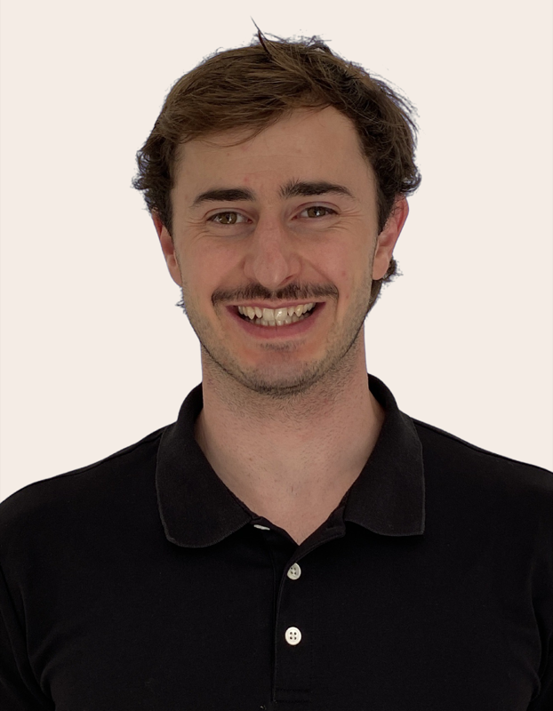

::: {.content-visible when-profile="english"}

:::: {.grid}
::: {.g-col-12 .g-col-sm-4 .g-col-md-3}
{.headshot fig-alt="Headshot of Matthew Hawke"}
:::
::: {.g-col-12 .g-col-sm-8 .g-col-md-9}
# Matthew Hawke

I am a passionate and ambitious health scientist in the third semester of an
M.Sc. in Public Health, Exercise and Nutrition at the University of Potsdam. My
professional background includes clinical experience as a physiotherapist and as
a senior operational advisor in the New Zealand public service.
:::
::::

## Experience

Jul 2026 – Dec 2026Student Research Intern — Professorship of Social and Preventive Medicine, University of Potsdam

Nov 2025 – presentPhysiotherapist — Caritas-Klinik St. Anna, Berlin

Oct 2025 – presentM.Sc. Public Health, Exercise and Nutrition — University of Potsdam

May 2025 – Oct 2025Volunteer Worker — Wilmersdorfer Seniorenstiftung, Berlin

Nov 2023 – Aug 2024CrossFit Coach &amp; Group Fitness Instructor — CrossFit Poneke, Wellington

Jul 2022 – Apr 2024Senior Advisor — Immigration New Zealand, Ministry of Business, Innovation and Employment, Wellington

Feb 2022 – Jul 2022Business Advisor — Immigration New Zealand, Ministry of Business, Innovation and Employment, Wellington

Aug 2021 – Feb 2022Personal Assistant / Team Administrator — Immigration New Zealand, Ministry of Business, Innovation and Employment, Wellington

Jan 2020 – Aug 2021Physiotherapist — Dalman Physiotherapy, Wellington

Jan 2020 – Aug 2021Volunteer Physiotherapist — Waterside Karori Women's Football Club, Wellington

Feb 2016 – Nov 2019Bachelor of Health Science (Physiotherapy) — Auckland University of Technology

:::

::: {.content-visible when-profile="german"}

:::: {.grid}
::: {.g-col-12 .g-col-sm-4 .g-col-md-3}
{.headshot fig-alt="Porträtfoto von Matthew Hawke"}
:::
::: {.g-col-12 .g-col-sm-8 .g-col-md-9}
# Matthew Hawke

Ich bin ein leidenschaftlicher und ambitionierter Gesundheitswissenschaftler im
dritten Semester des M.Sc. Public Health, Exercise and Nutrition an der
Universität Potsdam. Zu meinem beruflichen Werdegang zählen klinische Erfahrung
als Physiotherapeut sowie eine Tätigkeit als Senior Operational Advisor im
neuseeländischen öffentlichen Dienst.
:::
::::

## Werdegang

Jul. 2026 – Dez. 2026Studentischer Forschungspraktikant — Professur für Sozial- und Präventivmedizin, Universität Potsdam

Nov. 2025 – heutePhysiotherapeut — Caritas-Klinik St. Anna, Berlin

Okt. 2025 – heuteM.Sc. Public Health, Exercise and Nutrition — Universität Potsdam

Mai 2025 – Okt. 2025Ehrenamtliche Tätigkeit — Wilmersdorfer Seniorenstiftung, Berlin

Nov. 2023 – Aug. 2024CrossFit-Coach &amp; Group-Fitness-Trainer — CrossFit Poneke, Wellington

Juli 2022 – Apr. 2024Senior Advisor — Immigration New Zealand, Ministry of Business, Innovation and Employment, Wellington

Feb. 2022 – Juli 2022Business Advisor — Immigration New Zealand, Ministry of Business, Innovation and Employment, Wellington

Aug. 2021 – Feb. 2022Persönlicher Assistent / Teamadministrator — Immigration New Zealand, Ministry of Business, Innovation and Employment, Wellington

Jan. 2020 – Aug. 2021Physiotherapeut — Dalman Physiotherapy, Wellington

Jan. 2020 – Aug. 2021Ehrenamtlicher Physiotherapeut — Waterside Karori Women's Football Club, Wellington

Feb. 2016 – Nov. 2019Bachelor of Health Science (Physiotherapie) — Auckland University of Technology

:::
