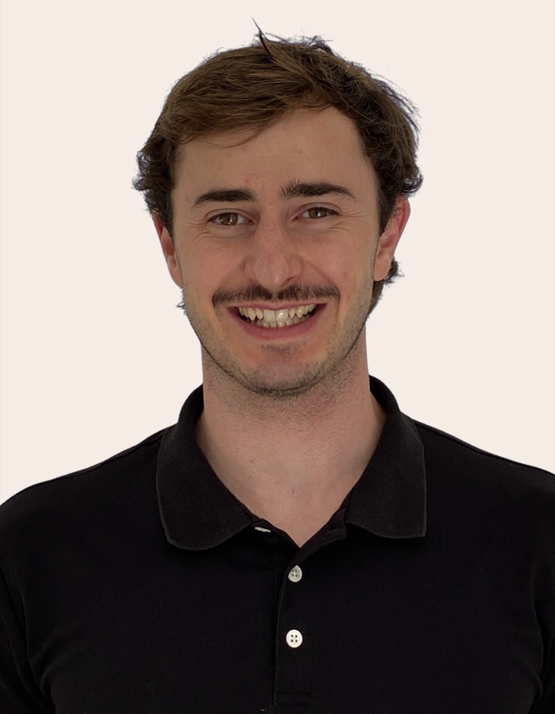
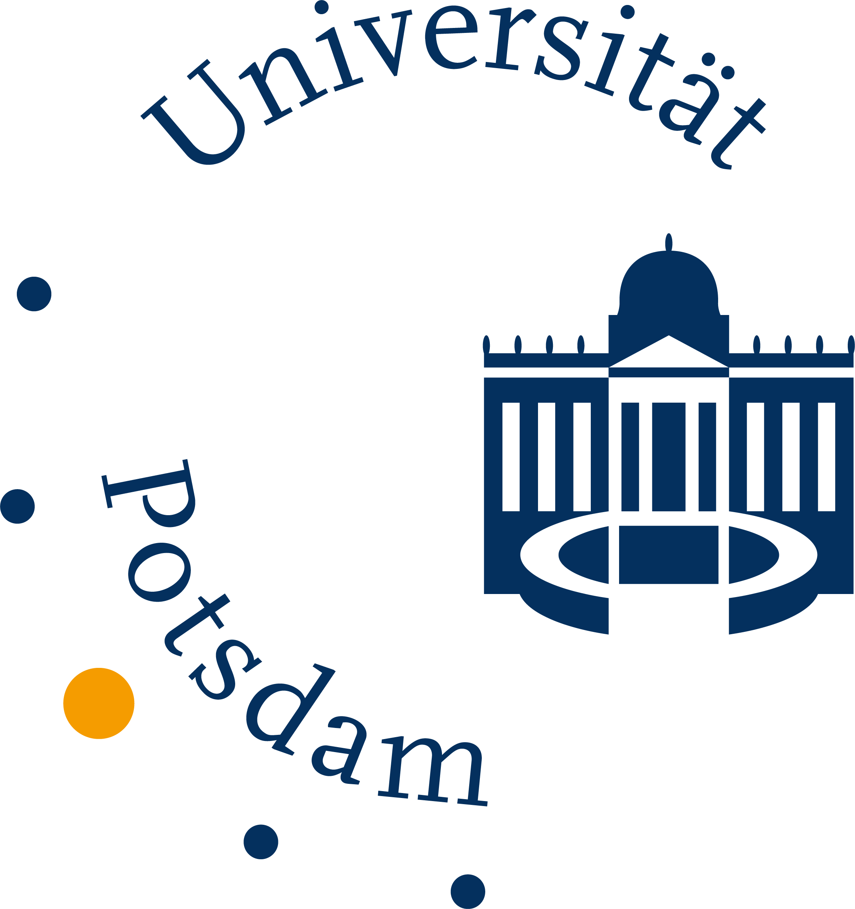
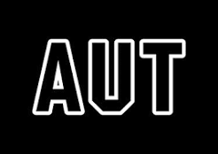
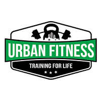
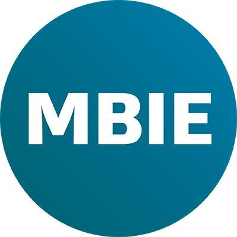
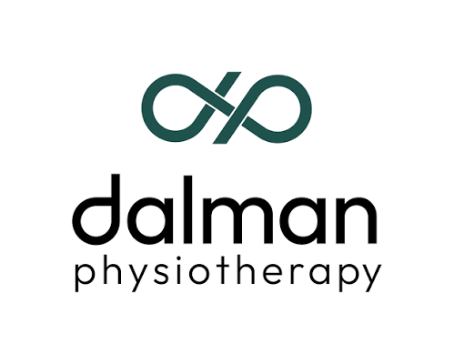
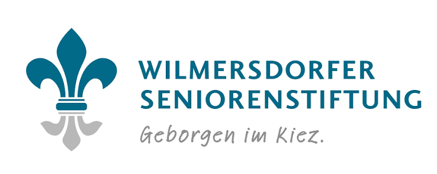
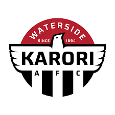

::: {.content-visible when-profile="english"}

:::: {.grid}
::: {.g-col-12 .g-col-sm-4 .g-col-md-3}
{.headshot fig-alt="Headshot of Matthew Hawke"}
:::
::: {.g-col-12 .g-col-sm-8 .g-col-md-9}
# Matthew Hawke

I am a passionate and ambitious health scientist in the third semester of an
M.Sc. in Public Health, Exercise and Nutrition at the University of Potsdam. My
professional background includes clinical experience as a physiotherapist and as
a senior operational advisor in the New Zealand public service.
:::
::::

## Education

Oct 2025 – present
M.Sc. Public Health, Exercise and Nutrition — University of Potsdam<a class="timeline-more" href="experience/msc-potsdam.html">Learn more</a>

Feb 2016 – Nov 2019
Bachelor of Health Science (Physiotherapy) — Auckland University of Technology<a class="timeline-more" href="experience/bachelor-aut.html">Learn more</a>

## Work experience

Jul 2026 – Dec 2026
Student Research Intern — Professorship of Social and Preventive Medicine, University of Potsdam<a class="timeline-more" href="experience/research-intern-potsdam.html">Learn more</a>

Nov 2025 – present
Working Student, Physiotherapy — Caritas-Klinik St. Anna, Berlin<a class="timeline-more" href="experience/physiotherapist-caritas.html">Learn more</a>

Nov 2023 – Aug 2024
CrossFit Coach &amp; Group Fitness Instructor — CrossFit Poneke, Wellington<a class="timeline-more" href="experience/crossfit-coach.html">Learn more</a>

Aug 2021 – Apr 2024
Immigration New Zealand, Ministry of Business, Innovation and Employment, Wellington<ul class="timeline-subroles"><li>Senior AdvisorJul 2022 – Apr 2024<a class="timeline-more" href="experience/mbie-senior-advisor.html">Learn more</a></li><li>Business AdvisorFeb 2022 – Jul 2022<a class="timeline-more" href="experience/mbie-business-advisor.html">Learn more</a></li><li>Personal Assistant / Team AdministratorAug 2021 – Feb 2022<a class="timeline-more" href="experience/mbie-personal-assistant.html">Learn more</a></li></ul>

Jan 2020 – Aug 2021
Physiotherapist — Dalman Physiotherapy, Wellington<a class="timeline-more" href="experience/physiotherapist-dalman.html">Learn more</a>

## Volunteer experience

May 2025 – Oct 2025
Volunteer Worker — Wilmersdorfer Seniorenstiftung, Berlin<a class="timeline-more" href="experience/volunteer-seniorenstiftung.html">Learn more</a>

Jan 2020 – Aug 2021
Volunteer Physiotherapist — Waterside Karori Women's Football Club, Wellington<a class="timeline-more" href="experience/volunteer-physio-waterside.html">Learn more</a>

:::

::: {.content-visible when-profile="german"}

:::: {.grid}
::: {.g-col-12 .g-col-sm-4 .g-col-md-3}
{.headshot fig-alt="Porträtfoto von Matthew Hawke"}
:::
::: {.g-col-12 .g-col-sm-8 .g-col-md-9}
# Matthew Hawke

Ich bin ein leidenschaftlicher und ambitionierter Gesundheitswissenschaftler im
dritten Semester des M.Sc. Public Health, Exercise and Nutrition an der
Universität Potsdam. Zu meinem beruflichen Werdegang zählen klinische Erfahrung
als Physiotherapeut sowie eine Tätigkeit als Senior Operational Advisor im
neuseeländischen öffentlichen Dienst.
:::
::::

## Ausbildung

Okt. 2025 – heute
M.Sc. Public Health, Exercise and Nutrition — Universität Potsdam<a class="timeline-more" href="experience/msc-potsdam.html">Mehr erfahren</a>

Feb. 2016 – Nov. 2019
Bachelor of Health Science (Physiotherapie) — Auckland University of Technology<a class="timeline-more" href="experience/bachelor-aut.html">Mehr erfahren</a>

## Berufserfahrung

Juli 2026 – Dez. 2026
Studentischer Forschungspraktikant — Professur für Sozial- und Präventivmedizin, Universität Potsdam<a class="timeline-more" href="experience/research-intern-potsdam.html">Mehr erfahren</a>

Nov. 2025 – heute
Werkstudent, Physiotherapie — Caritas-Klinik St. Anna, Berlin<a class="timeline-more" href="experience/physiotherapist-caritas.html">Mehr erfahren</a>

Nov. 2023 – Aug. 2024
CrossFit-Coach &amp; Group-Fitness-Trainer — CrossFit Poneke, Wellington<a class="timeline-more" href="experience/crossfit-coach.html">Mehr erfahren</a>

Aug. 2021 – Apr. 2024
Immigration New Zealand, Ministry of Business, Innovation and Employment, Wellington<ul class="timeline-subroles"><li>Senior AdvisorJuli 2022 – Apr. 2024<a class="timeline-more" href="experience/mbie-senior-advisor.html">Mehr erfahren</a></li><li>Business AdvisorFeb. 2022 – Juli 2022<a class="timeline-more" href="experience/mbie-business-advisor.html">Mehr erfahren</a></li><li>Persönlicher Assistent / TeamadministratorAug. 2021 – Feb. 2022<a class="timeline-more" href="experience/mbie-personal-assistant.html">Mehr erfahren</a></li></ul>

Jan. 2020 – Aug. 2021
Physiotherapeut — Dalman Physiotherapy, Wellington<a class="timeline-more" href="experience/physiotherapist-dalman.html">Mehr erfahren</a>

## Ehrenamtliches Engagement

Mai 2025 – Okt. 2025
Ehrenamtliche Tätigkeit — Wilmersdorfer Seniorenstiftung, Berlin<a class="timeline-more" href="experience/volunteer-seniorenstiftung.html">Mehr erfahren</a>

Jan. 2020 – Aug. 2021
Ehrenamtlicher Physiotherapeut — Waterside Karori Women's Football Club, Wellington<a class="timeline-more" href="experience/volunteer-physio-waterside.html">Mehr erfahren</a>

:::
